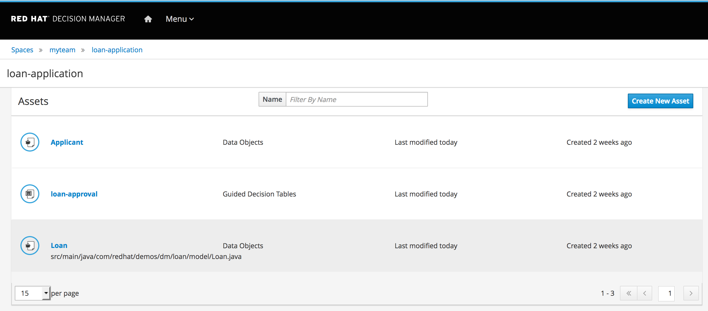
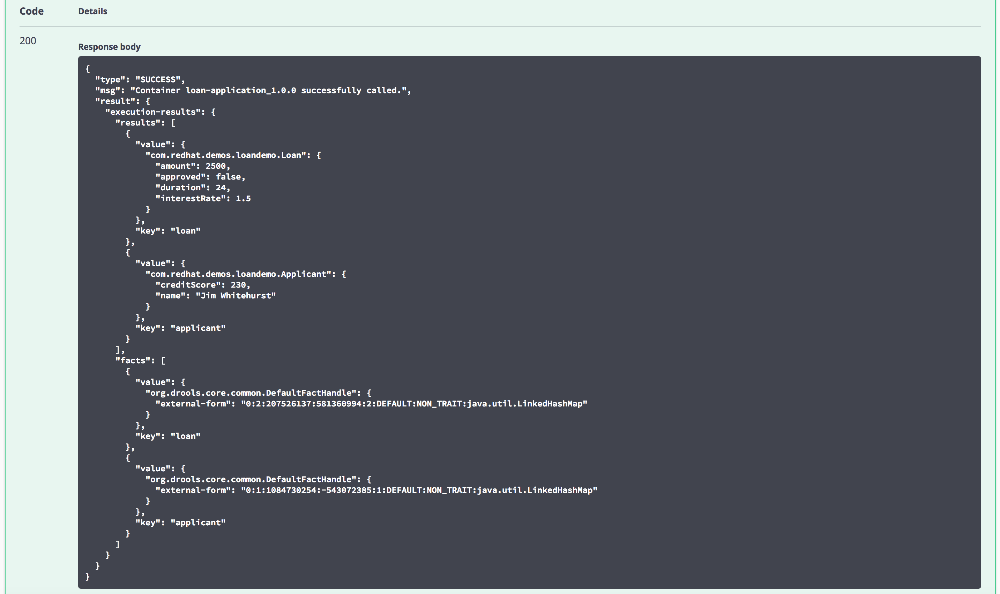

Red Hat Decision Manager Loan Demo
=============================================
This demo project will provide you with an example of creating, deploying and leveraging a set of rules
(defined in a decision table) in a Decision Server. You will be given examples of calling the rules as if
using it from an application through the REST API that is exposed by the server.

There are three options for you to install this project: local, OpenShift and Docker

Software
--------
The following software is required to run this demo:
- [JBoss EAP 7.1 zip](https://developers.redhat.com/download-manager/file/jboss-eap-7.1.0.zip)
- [Red Hat Decision Manager 7.0.0.GA Decision Central deployable for EAP 7](https://developers.redhat.com/download-manager/file/rhdm-7.0.0.GA-decision-central-eap7-deployable.zip)
- [Red Hat Decision Manager: KIE-Server 7.0.0.GA deployable for EE7](https://developers.redhat.com/download-manager/file/rhdm-7.0.0.GA-kie-server-ee7.zip)
- [7-Zip](http://www.7-zip.org/download.html) (Windows only): to overcome the Windows 260 character path length limit, we need 7-Zip to unzip the Decision Manager deployable.

Option 1 - Install on your machine
----------------------------------
1. [Download and unzip.](https://github.com/jbossdemocentral/rhdm7-loan-demo/archive/master.zip) or [clone this repo](https://github.com/jbossdemocentral/rhdm7-loan-demo.git).

2. Add the product ZIP files to the installs directory.

3. Run `init.sh` (Linux/macOS) or `init.ps1` (Windows) file.

4. Start Red Hat Decision Manager by running `./target/jboss-eap-7.1/bin/standalone.sh`

5. Login to http://localhost:8080/decision-central

    ```
    - login for admin and analyst roles (u:dmAdmin / p:redhatdm1!)
    ```
6. Click on the "loan-application" project to open the Loan Application Demo project.

7. The project has simple data model (Loan & Applicant) and single decision table (loan-application) which contains the loan approval rule set.

8. Build and deploy version 1.0.0 of the project. Click on the "Build and Deploy" in the upper right corner.

9. Go to "Menu -> Deploy -> Execution Servers" repository to see the loan-application_1.0.0 KIE Container deployed on the Decision Server.

10. The Decision Server provides a Swagger UI that documents the full RESTful interface exposed by the server at: http://localhost:8080/kie-server/docs

11. In the Swagger UI:
   - navigate to "KIE Server :: Core"
   - expand the "GET" operation for resource "/server/containers"
   - click on "Try it out"
   - leave the parameters blank and click on "Execute"
   - when asked for credentials use: Username: kieserver, Password: kieserver1!
   - observe the response, which lists the KIE Containers deployed on the server and their status (STARTED, STOPPED).

12. We can use the Swagger UI to test our Loan Approval Decision Service. In the Swagger UI:
   - navigate to "Rules evalutation :: BRM"
   - expand the "POST" operation for resource "/server/containers/instances/{id}"
   - click on "Try it out"
   - set the "id" parameter to the name of the KIE Container that hosts our rules, in this case `loan-application_1.0.0`.
   - set "Parameter content type" to `application/json`.
   - set "Response content type" to `application/json`
   - use the following request as the "body" parameter. Note that the `Loan` object has its `approved` attribute set to `false`:

    {
        "lookup":"default-stateless-ksession",
        "commands":[
            {
                "insert":{
                    "object":{
                        "com.redhat.demos.loandemo.Applicant":{
                            "creditScore":230,
                            "name":"Jim Whitehurst"
                        }
                    },
                    "out-identifier":"applicant"
                }
            },
            {
                "insert":{
                    "object":{
                        "com.redhat.demos.loandemo.Loan":{
                            "amount":2500,
                            "approved":false,
                            "duration":24,
                            "interestRate":1.5
                        }
                    },
                    "out-identifier":"loan"
                }
            },
            {
                "fire-all-rules":{
                }
            }
        ]
    }

   - observe the result. The Loan Application rules have fired and determined that, based on the credit score of the application, and the amount of the loan, the loan can be approved. The `approved` attribute of the `Loan` has been set to `true`.

13. You can change the decision table as desired, change the version of the project, and redeploy a new version to a new KIE Container (allowing you to serve multiple versions of the same rule set at the same time on the same Decision Server). You can also build a new version of the project and use the Version Configuration tab of the container definition (in the Execution Servers screen) to manage the container using the UPGRADE button to pull the new version.


Option 2 - Run on OpenShift
-----------------------------------------
This demo can be installed on Red Hat OpenShift in various ways. We'll explain the different options provided.

All installation options require an `oc` client installation that is connected to a running OpenShift instance. More information on OpenShift and how to setup a local OpenShift development environment based on the Red Hat Container Development Kit can be found [here](https://developers.redhat.com/products/cdk/overview/).

---
**NOTE**

The Red Hat Decision Manager 7 - Decision Central image requires a [Persistent Volume](https://docs.openshift.com/container-platform/3.7/architecture/additional_concepts/storage.html) which has both `ReadWriteOnce` (RWO) *and* `ReadWriteMany` (RWX) Access Types. If no PVs matching this description are available, deployment of that image will fail until a PV of that type is available.

---

### Automated installation, manual project import
This installation option will install the Decision Manager 7 and Decision Service in OpenShift using a single script, after which the demo project needs to be manually imported.

1. [Download and unzip.](https://github.com/jbossdemocentral/rhdm7-loan-demo/archive/master.zip) or [clone this repo](https://github.com/jbossdemocentral/rhdm7-loan-demo.git).

2. Run the "init-openshift.sh" file (for Linux and macOS, Windows support will be added in the near future). This will create a new project and application in OpenShift.

3. Login to your OpenShift console. For a local OpenShift installation this is usually: https://{host}:8443/console

4. Open the project "RHDM7 Loan Demo". Open the "Overview". Wait until the 2 pods, "rhdm7-loan-rhdmcentr" and "rhdm7-loan-kieserver" have been deployed.

5. Open the "Applications -> Routes" screen. Click on the "Hostname" value next to "rhdm7-loan-rhdmcentr". This opens the Decision Central console.

6. Login to Decision Central:

    ```
    - login for admin and analyst roles (u:dmAdmin / p:redhatdm1!)
    ```
7. Click on "Design" to open the design perspective.

8. Click on "Import project". Enter the following as the repository URL: https://github.com/jbossdemocentral/rhdm7-loan-demo-repo.git , and click on "Import".

9. Select "loan-application" and "Ok" button on the right-hand side of the screen.

10. The project has simple data model (Loan & Applicant) and single decision table (loan-application) which contains the loan approval rule set.

11. Build and deploy version 1.0.0 of the project. Click on the "Build and Deploy" in the upper right corner.

12. Go to "Menu -> Deploy -> Execution Servers" repository to see the loan-application_1.0.0 KIE Container deployed on the Decision Server.

13. The Decision Server provides a Swagger UI that documents the full RESTful interface exposed by the server at. To open the Swagger UI, go back to
the OpenShift console, and go to the "Applications - Routes" screen. Copy the "Hostname" value next to "rhdm7-loan-kieserver". Paste the URL in a browser tab
and add "/docs" to the URL. This will show the Swagger UI.

14. Follow instructions from above "Option 1- Install on your machine", starting at step 11.

### Scripted installation
This installation option will install the Decision Manager 7 and Decision Service in OpenShift using a the provided `provision.sh` script, which gives
the user a bit more control how to provision to OpenShift.

1. [Download and unzip.](https://github.com/jbossdemocentral/rhdm7-loan-demo/archive/master.zip) or [clone this repo](https://github.com/jbossdemocentral/rhdm7-loan-demo.git).

2. In the demo directory, go to `./support/openshift`. In that directory you will find a `provision.sh` script. (Windows support will be introduced at a later time).

3. Run `./provision.sh -h` to inspect the installation options.

4. To provision the demo, with the OpenShift ImageStreams in the project's namespace, run `./provision.sh setup rhdm7-loan --with-imagestreams true`.

    ---
    **NOTE**

    The `--with-imagestreams true` parameter installs the Decision Manager 7 image streams and templates into the project namespace instead of the `openshift` namespace (for which you need admin rights). If you already have the required image-streams and templates installed in your OpenShift environment in the `openshift` namespace, you can omit the `--with-imagestreams true` from the setup command.

    ---

5. To delete an already provisioned demo, run `./provision.sh delete rhdm7-loan`.

6. After provisioning, follow the instructions from above "Option 2 - Automated installation, manual project import", starting at step 2.


Option 3 - Run in Docker
-----------------------------------------
The following steps can be used to configure and run the demo in a container

1. [Download and unzip.](https://github.com/jbossdemocentral/rhdm7-loan-demo/archive/master.zip) or [clone this repo](https://github.com/jbossdemocentral/rhdm7-loan-demo.git).

2. Add the product ZIP files to installs directory.

3. Run the 'init-docker.sh' (Linux/macOS) or 'init-docker.ps1' (Windows) file.

4. Start the container: `docker run -it -p 8080:8080 -p 9990:9990 jbossdemocentral/rhdm7-loan-demo`

5. Follow instructions from above "Option 1- Install on your machine", starting at step 5 replacing *localhost* with *&lt;CONTAINER_HOST&gt;* when applicable.

Additional information can be found in the jbossdemocentral container [developer repository](https://github.com/jbossdemocentral/docker-developer)


Supporting Articles & Videos
----------------------------
- [Your first Decision Services on Red Hat Decision Manager 7](https://upload.wikimedia.org/wikipedia/commons/6/67/Learning_Curve_--_Coming_Soon_Placeholder.png)

- [Getting Started with Red Hat Decision Manager 7](https://upload.wikimedia.org/wikipedia/commons/6/67/Learning_Curve_--_Coming_Soon_Placeholder.png)


Released versions
-----------------
See the tagged releases for the following versions of the product:

- v1.0 Red Hat Decision Manager 7.0.0.GA






